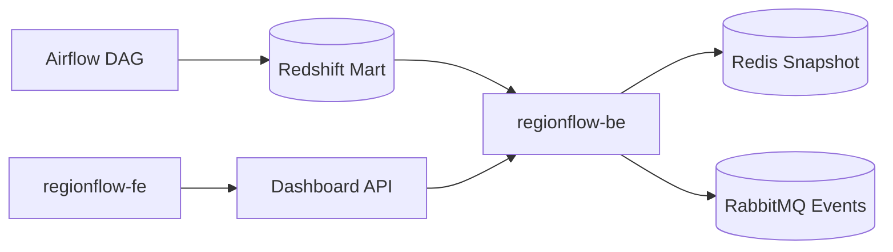

# RegionFlow Workspace

[](https://github.com/regionflow-data/regionflow-workspace/actions/workflows/ci.yml)

지역별 주문 수요, 품절률, 배송 시간을 집계해 운영 액션으로 바꾸는 데이터 워크스페이스입니다.

## 해결하는 문제

지역 단위 수요는 주문 건수만 보면 늦게 보입니다. RegionFlow는 품절률과 배송 시간을 같이 집계해서 재고 재배치가 필요한 지역을 먼저 찾습니다.

## 레포 구조

| 구분 | 레포 | 설명 |
| --- | --- | --- |
| Workspace | [`regionflow-workspace`](https://github.com/cyjoon68/regionflow-workspace) | Git submodule 루트 |
| Frontend | [`regionflow-fe`](https://github.com/regionflow-data/regionflow-fe) | Expo 기반 지역 분석 대시보드 |
| Backend | [`regionflow-be`](https://github.com/regionflow-data/regionflow-be) | Python, Airflow, Redshift 분석 파이프라인 |

## 주요 기능

- 지역별 주문 신호를 수요 지수로 변환
- 품절률 기준으로 재고 재배치 액션 생성
- Airflow DAG와 Redshift SQL 경계를 분리

## 아키텍처



## 기술 스택

- Frontend: Expo Router, React Native, `ky`, `react-native-unistyles`
- Backend: Python, Airflow, Redshift
- Infra baseline: MySQL, Redis, RabbitMQ, GitHub Actions, ArgoCD
- Observability: Datadog, Grafana, Sentry

## 실행

```bash
git submodule update --init --recursive
cd regionflow-be && PYTHONPATH=src python3 -m pytest
cd ../regionflow-fe && npm install && npm test
```

## 운영 기준

- 기본 브랜치: `develop`
- 배포 기준: CI 통과 후 ArgoCD 동기화
- 관측 기준: DAG duration, stockout rate, snapshot freshness

## 다음 개선

- 지역 클러스터별 임계치 분리
- Redshift materialized view 적용
- 품절 예측 모델 연결
